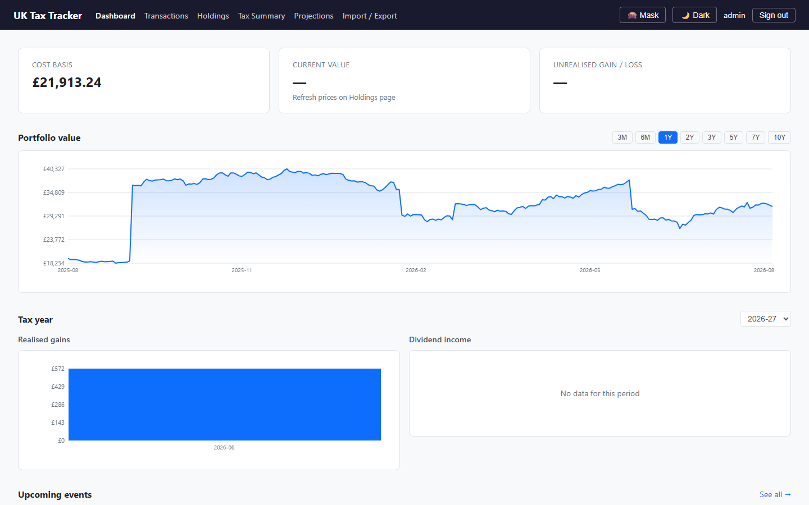
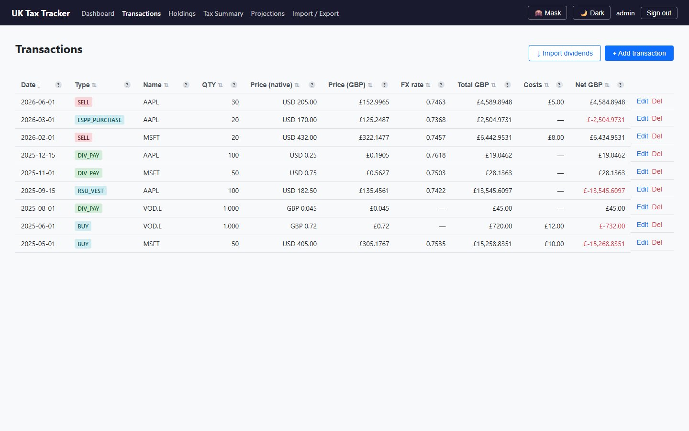
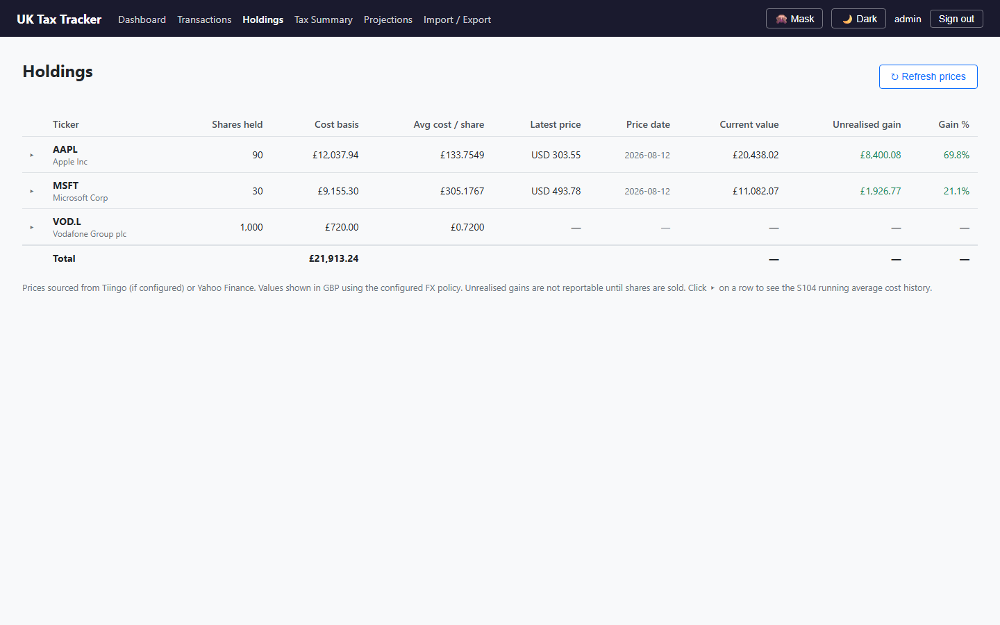
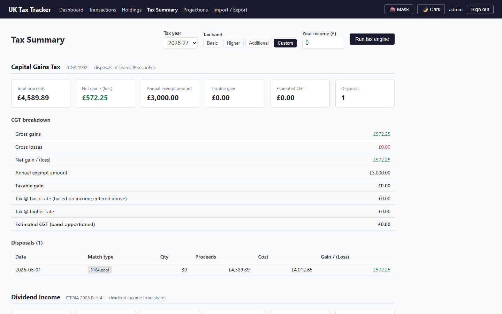
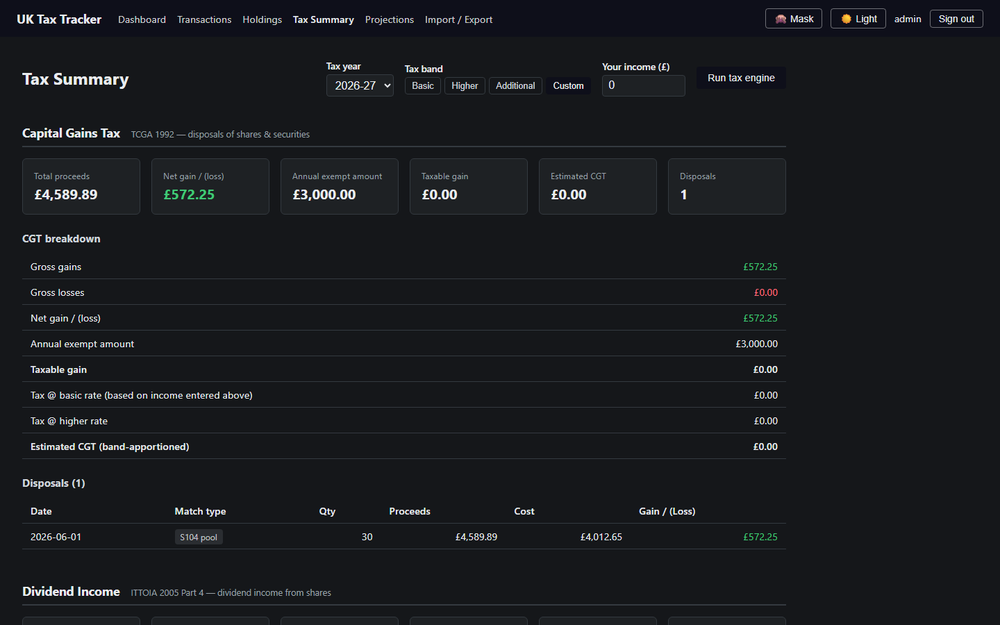
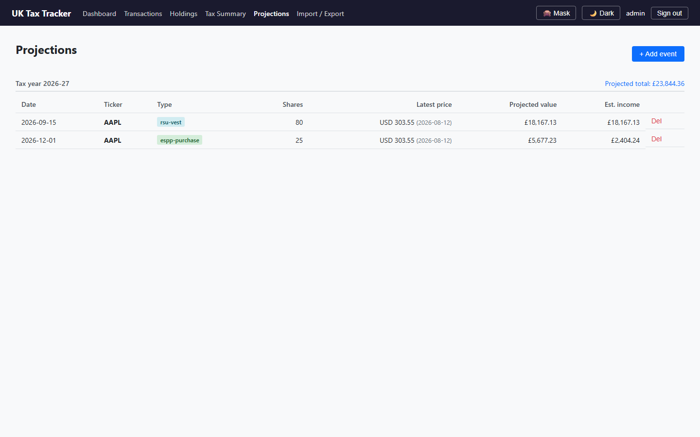
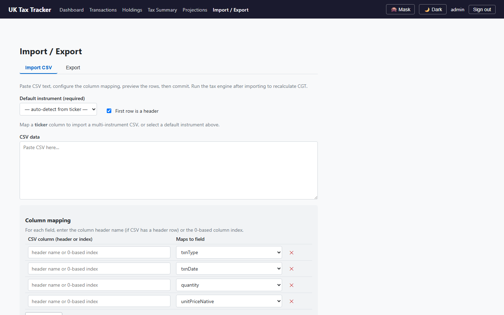
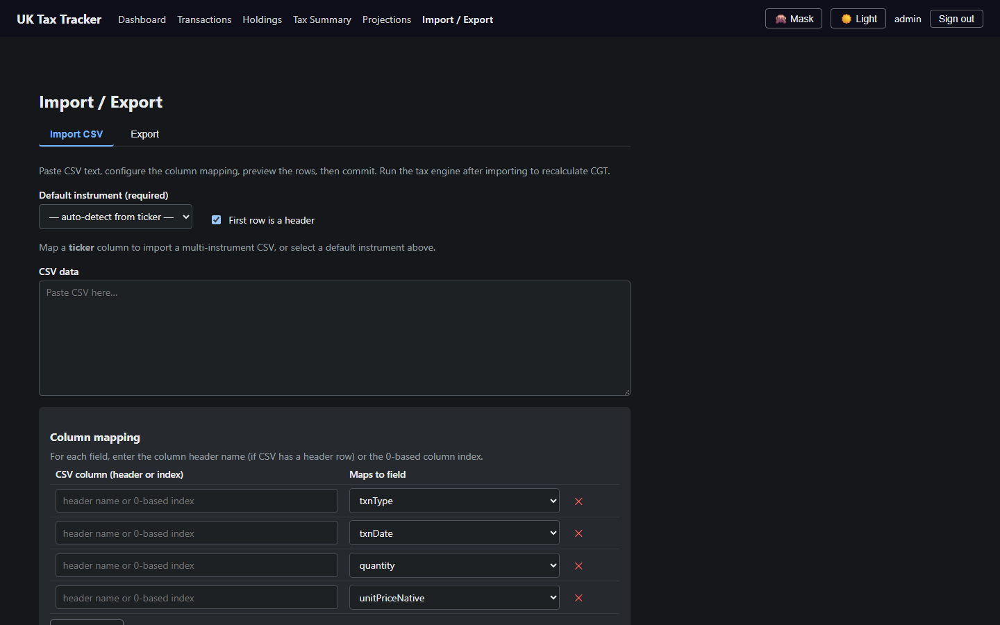

# UK Share Tax Liability Tracker

A self-hosted single-user web app for tracking UK Capital Gains Tax, dividend income, and employment income from RSU/ESPP equity grants. Built on Fastify + Svelte 5 + SQLite — no external database server required. Supports light and dark themes.

---

## Screenshots

_Populated with dummy data — no real financial information._

| | |
|---|---|
| **Dashboard** |  |
| **Transactions** |  |
| **Holdings** |  |
| **Tax Summary — light** |  |
| **Tax Summary — dark** |  |
| **Projections** |  |
| **Import / Export — light** |  |
| **Import / Export — dark** |  |

---

## Prerequisites

- **Node.js ≥ 24** (uses the built-in `node:sqlite` module)

### Installing Node.js

**macOS** — using [Homebrew](https://brew.sh):
```bash
brew install node
```

**Linux** — using [nvm](https://github.com/nvm-sh/nvm) (works on any distro):
```bash
curl -o- https://raw.githubusercontent.com/nvm-sh/nvm/HEAD/install.sh | bash
# restart your shell, then:
nvm install 26
nvm use 26
```

**Windows** — using [winget](https://learn.microsoft.com/en-us/windows/package-manager/winget/):
```powershell
winget install OpenJS.NodeJS.LTS
```
After install, open a new terminal for the `node` and `npm` commands to be available.

---

## Setup

### 1. Clone and install

```bash
git clone https://github.com/apilbeam101/tax-tracker.git tax-tracker
cd tax-tracker
npm install
```

### 2. Generate secrets

```bash
# SESSION_SECRET — at least 32 bytes of random hex
node -e "console.log(require('crypto').randomBytes(32).toString('hex'))"

# ENCRYPTION_KEY — 32-byte key for AES-256-GCM field encryption
node -e "console.log(require('crypto').randomBytes(32).toString('hex'))"
```

### 3. Configure .env

```bash
cp .env.example .env
```

Edit `.env` and fill in:

| Variable | Required | Description |
|---|---|---|
| `SESSION_SECRET` | Yes | 64-char hex string for cookie signing |
| `ENCRYPTION_KEY` | Yes | 64-char hex string for field-level AES-256-GCM encryption |
| `PORT` | No | Server port (default: `3000`) |
| `HOST` | No | Bind address (default: `127.0.0.1`) |
| `DB_PATH` | No | SQLite file path (default: `./data/taxtracker.db`) |
| `FX_RATE_POLICY` | No | `hmrc-monthly` (default) or `daily-spot` |
| `TIINGO_API_KEY` | No | Live price data (free tier: 500 symbols, 50 req/hr) |
| `ALPHA_VANTAGE_API_KEY` | No | Dividend history import (free at alphavantage.co) |
| `NODE_ENV` | No | Set to `production` to enable secure cookies over HTTPS |

### 4. Build and start

```bash
npm run build
npm start
```

Or, for development with hot-reload:

```bash
npm run dev
```

### 5. First-run setup

Open `http://localhost:3000` in your browser. You will be prompted to create a passphrase — this derives the encryption key used for sensitive field-level encryption. **Store this passphrase securely; losing it means losing access to encrypted data.**

After setup, log in with the username and password you created. A 🌙/☀️ toggle in the nav bar (next to the number-masking toggle) switches between light and dark themes; the choice is remembered in your browser.

---

## Docker (alternative to steps 3-4 above)

```bash
cp .env.example .env
```

Edit `.env` and fill in **real, generated** `SESSION_SECRET`/`ENCRYPTION_KEY` values (step 2 above) — the placeholders in `.env.example` are non-empty strings that pass validation, so the app will start happily with a publicly-known secret if you skip this.

The container runs as a fixed non-root UID (`10001`), and its SQLite data lives in a directory bind-mounted from the host (`./data`) so it survives a container recreate. That host directory needs to already be owned by that UID before the first run — Docker does not do this for you on a bind mount:

```bash
mkdir -p data
sudo chown -R 10001:10001 data
```

Then build and start:

```bash
docker compose -f deploy/docker-compose.yml up -d --build
```

The published port is bound to `127.0.0.1` only, same as the non-Docker setup — put it behind a reverse proxy (see [Reverse proxy (HTTPS)](#reverse-proxy-https) below) rather than exposing it directly. `npm run backup` on the host still works unmodified against `data/taxtracker.db`, since the container's `DB_PATH` maps to the same relative path.

---

## Optional: Live prices (Tiingo)

1. Sign up for a free account at [tiingo.com](https://www.tiingo.com)
2. Copy your API token to `.env` as `TIINGO_API_KEY`
3. Restart the server

Without Tiingo, prices fall back to Yahoo Finance (no API key required). If neither returns data, holdings valuations will show `—`.

## Optional: Dividend history import (Alpha Vantage)

1. Get a free API key at [alphavantage.co](https://www.alphavantage.co)
2. Add to `.env` as `ALPHA_VANTAGE_API_KEY`
3. Use the "↓ Import dividends" button on the Transactions page to pull dividend history per instrument

For USD-currency holdings, US withholding tax (15% under the UK-US tax treaty, assuming a valid W-8BEN is on file with your broker) is filled in automatically on dividend transactions when no withholding amount is entered or imported. Edit the transaction afterwards if your actual broker statement shows a different figure — an explicit value is never overwritten.

---

## Running the tax engine

After entering transactions, open **Tax Summary** and click **Run tax engine** (or `POST /api/tax/run`) to calculate CGT disposals. This is idempotent — it deletes and re-inserts disposal records for each instrument.

If your imported transactions are missing GBP fields, run the FX backfill first:

```bash
node --env-file=.env --import tsx/esm scripts/backfill-fx.ts
```

---

## Database backup

```bash
npm run backup
```

Creates a timestamped copy at `data/backups/taxtracker-YYYY-MM-DDTHH-MM-SS.db`. Schedule this via cron for regular backups:

```cron
0 2 * * * cd /path/to/claude-tax && npm run backup
```

---

## Reverse proxy (HTTPS)

Run the app behind a reverse proxy with TLS. The server binds to `127.0.0.1` by default — do **not** expose port 3000 directly.

Set `NODE_ENV=production` in `.env` to enable `Secure` cookies (required for HTTPS).

### Caddy (recommended)

```
your-domain.example.com {
    reverse_proxy 127.0.0.1:3000
}
```

Caddy handles TLS automatically via Let's Encrypt. No further config needed.

### nginx

```nginx
server {
    listen 443 ssl;
    server_name your-domain.example.com;

    ssl_certificate     /etc/letsencrypt/live/your-domain.example.com/fullchain.pem;
    ssl_certificate_key /etc/letsencrypt/live/your-domain.example.com/privkey.pem;
    ssl_protocols       TLSv1.2 TLSv1.3;
    ssl_ciphers         HIGH:!aNULL:!MD5;

    location / {
        proxy_pass         http://127.0.0.1:3000;
        proxy_set_header   Host $host;
        proxy_set_header   X-Real-IP $remote_addr;
        proxy_set_header   X-Forwarded-For $proxy_add_x_forwarded_for;
        proxy_set_header   X-Forwarded-Proto $scheme;
    }
}

server {
    listen 80;
    server_name your-domain.example.com;
    return 301 https://$host$request_uri;
}
```

Use Certbot to issue the certificate:

```bash
certbot --nginx -d your-domain.example.com
```

---

## Development commands

```bash
npm run dev          # Dev server with hot-reload (tsx watch)
npm run build        # Full build: Svelte SPA then TypeScript server
npm test             # Run all tests once
npm run test:watch   # Vitest watch mode
npm run lint         # Biome check (lint + format check)
npm run backup       # Timestamped DB backup to data/backups/
```

Run a single test file:

```bash
npx vitest run src/server/services/tax/matching.test.ts
```

---

## Security

### OWASP Top 10 review (self-hosted threat model)

| # | Risk | Status |
|---|---|---|
| A01 Broken Access Control | All API routes require a valid session via `requireAuth`. Single-tenant design — `tenant_id` scoped on every query. No IDOR: IDs are validated against `tenant_id` before returning. | **Mitigated** |
| A02 Cryptographic Failures | Passwords: argon2id with default cost parameters. Sessions: HttpOnly, `SameSite=Lax`, 8h idle timeout; `Secure` flag enabled in production. Field-level AES-256-GCM on sensitive columns. Session secret and encryption key are required env vars (server refuses to start without them). | **Mitigated** |
| A03 Injection | All DB queries use parameterised prepared statements — no string interpolation. Input validated via Fastify JSON schema before reaching route handlers. Decimal values validated with `/^\d+(\.\d+)?$/` before `big.js`. | **Mitigated** |
| A04 Insecure Design | Single-user, self-hosted. No user enumeration: login uses constant-time password check against a dummy hash when username is unknown. CSRF synchronizer token on all state-changing requests. | **Mitigated** |
| A05 Security Misconfiguration | `@fastify/helmet` sets strict CSP (`default-src 'self'`), `Referrer-Policy: same-origin`, and other security headers. `robots.txt` disallows all crawlers. Rate limiting: 200 req/min global; 10 req/15min on login; 5 req/15min on setup. | **Mitigated** |
| A06 Vulnerable Components | No browser-side JS dependencies beyond Svelte (compiled away). Server deps are minimal and version-pinned. Run `npm audit` regularly. | **Review periodically** |
| A07 Authentication Failures | argon2id hashing. Login rate-limited (10/15min). Session regenerated on login to prevent fixation. No "remember me" / persistent tokens. | **Mitigated** |
| A08 Software and Data Integrity | No dynamic `eval` or `new Function`. No CDN resources — all assets self-hosted. `import.meta` used for ESM resolution rather than `__dirname`. | **Mitigated** |
| A09 Logging and Monitoring | `audit_log` table records all create/update/delete on transactions and instruments with `old_data`/`new_data` JSON. Fastify request logging via Pino. | **Mitigated** |
| A10 SSRF | External HTTP calls are made only to pre-configured, hardcoded endpoints (HMRC, Frankfurter, Tiingo, Stooq, Alpha Vantage). No user-supplied URLs are fetched. | **Mitigated** |

### Additional notes

- **This app is single-user and self-hosted.** Do not expose port 3000 directly — always place it behind a reverse proxy with TLS.
- Keep your `.env` file out of version control (it is in `.gitignore`).
- Back up the database regularly (`npm run backup`). The backup is a plain SQLite file — store it somewhere safe, preferably off-site.
- Encrypted fields use a key derived from your passphrase. The plaintext key is never stored on disk.
